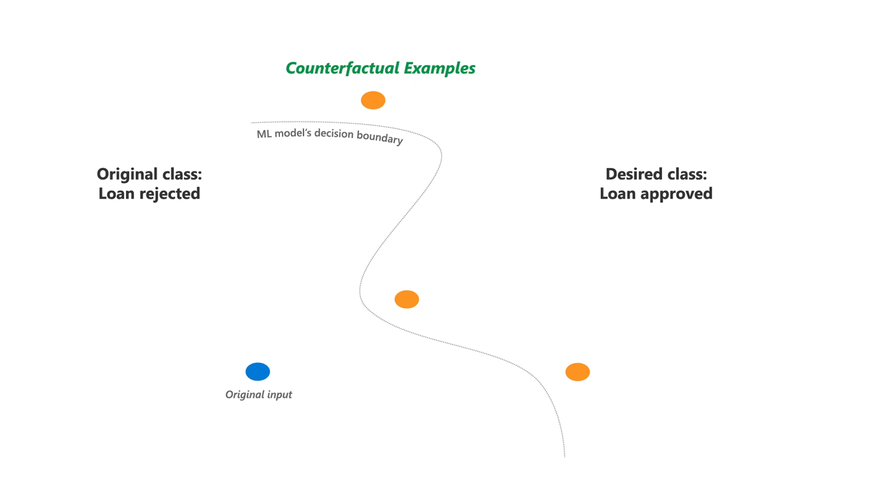

## Project LoyaltyMax: Enhancing Customer Loyalty with Machine Learning

- [Context](#context)
- [Introduction](#introduction)
   + [Data exploring](data_explorer.ipynb)
- [ML models](#ml-models)
   + [building the model](loyalty_drivers.ipynb)
- [Most important features](#most-important-features)
   + [building SHAP values](loyalty_drivers.ipynb)
- [Budget optimization](#budget-optimization)
   + [building the optimization model](optimizing_loyalty.ipynb)
- [What if?](#what-if?)
   + [DiCE model](optimizing_loyalty.ipynb)

# Context

This dataset comprises survey questions answered by over **100** respondents regarding their buying behavior at **Starbucks**.

The **primary objective** of this project is to **enhance customer loyalty** through the **analysis** of various features such as price, service, product quality, and more. 
By leveraging this data, we aim to provide **insights** into the impact of **investing** in these key areas and how it will influence customer loyalty. Ultimately, the project's output will enable us to make more **accurate pricing decisions** and develop targeted **marketing campaigns** to foster stronger customer loyalty and drive sales growth.

# Introduction

In the upcoming section, it is evident that a significant portion of our client base comprises young females who are either employed or students. Based on this valuable insight, our target audience should be tailored accordingly, and promotional campaigns should align with their preferences. However, several essential questions arise:

  - How should we strategically allocate the budget to achieve maximum impact?
  - Where should our primary focus lie to ensure the effectiveness of our campaigns?
  - If multiple factors come into play, what would be the optimal approach to budget allocation?

By addressing these questions thoughtfully, we can optimize our budget allocation and create impactful campaigns that resonate with our target audience, ultimately driving stronger engagement and loyalty among our customers.

# ML models

Having comprehended the project's context and scope, which revolves around defining the optimal strategy to enhance loyalty, we are now prepared to initiate the modeling process. However, before proceeding further, it is imperative to assess the importance of the features that we intend to evaluate.

Please note that there are additional features to consider, but for the purpose of this example, we will focus on essential aspects such as product quality, price rate, service rate, and other key factors that significantly impact customer loyalty. This preliminary evaluation will provide a solid foundation for our subsequent modeling efforts and enable us to make data-driven decisions to achieve our loyalty enhancement goals.

As observed in the preceding picture, the **price** feature received the lowest rating, while the **promos** and **service** aspects garnered positive feedback. Based on this information, I am inclined to consider a strategy that emphasizes improving the perception of **pricing** while acknowledging the positive response to promotional offers and service.

Additionally, given the (hyphotesis) high **elasticity** in the market, we have an opportunity to leverage **pricing** tactics effectively. By addressing the price perception and offering targeted promotions, we can foster stronger customer engagement and loyalty, positioning our brand more competitively within the market.

### Models

For this example, we will start with four models to predict loyal clients:

- Random Forest
- Logistic Regression
- Support Vector Machine
- Stochastic Gradient Descent

Once we determine the best-performing model, we will proceed to identify the most relevant features that influence the model's predictions. By understanding these key factors, we can develop the most effective strategy to allocate our budget strategically and enhance customer loyalty successfully. This process will enable us to make data-driven decisions and optimize our efforts to achieve the desired loyalty outcomes.

### Evaluation of the models

Upon reviewing the table, we can observe that the models have achieved respectable scores ranging from approximately 0.78 to 0.86. While this metric may suggest that both the logistic regression and random forest models are performing well, it is important to be cautious of potential misleading conclusions.

To ensure an accurate selection, we opt to prioritize the AUC ROC metric for evaluating our model's performance. This involves a meticulous fine-tuning of hyperparameters to make a more informed decision about the optimal model. By employing this rigorous approach, we can confidently choose the best-performing model, enabling us to drive more effective and reliable outcomes in our efforts to enhance customer loyalty.

Based on our analysis, it is evident that the **random forest model** outperforms the other options. Although its AUC ROC metric may not be the highest, we consider the baseline AUC ROC value, which stands at 0.5 for random predictions. In comparison, our model's AUC ROC score is slightly better, indicating its superior predictive capabilities.

In essence, the random forest model demonstrates a notable improvement over the baseline, making it the preferred choice among the models evaluated. Its ability to provide more accurate predictions than random chance is a significant indicator of its effectiveness in our pursuit of enhancing performance and achieving our desired outcomes.

# Most important features

To identify the most crucial features for our project, we will employ an explanatory model, specifically **SHAP (SHapley Additive exPlanations)**.

Before delving further, let's explore the concept behind SHAP values. Essentially, **SHAP** values utilize a game-theoretic approach to explain the output of any machine learning model. This method offers valuable insights into the contribution of each feature towards the final predictions, shedding light on which factors hold the most significant influence.

By leveraging **SHAP values**, we can gain a comprehensive understanding of the model's decision-making process and identify the key drivers impacting our project's outcomes. This will enable us to make well-informed decisions and allocate our resources strategically for maximizing the desired results.

After exploring the concept of SHAP values and generating the model, we have the following results:

 
 

As evident from the charts above, the **price** stands out as the most significant predictor, aligning with our initial findings at the project's outset. It is closely followed by the product and ambiance, which also play crucial roles in predicting customer loyalty. However, a peculiar observation emerges from the scatter plot, indicating that loyal clients rate the **price** negatively, contrary to our initial hypothesis of an **elastic market**.

This unexpected finding warrants further investigation to better comprehend the underlying dynamics and the factors influencing loyal clients' perceptions of price. By gaining a deeper understanding of this discrepancy, we can refine our strategy and make informed decisions to effectively boost customer loyalty and maximize our overall business success.

# Budget optimization

In the subsequent phase, our focus is on refining the strategy for budget allocation. To achieve this, we will employ linear programming to formulate the problem as a system of equations. Our objective is to determine the most optimal distribution of the budget. For this step, we assume the following cost for each feature:

 - *ambiance:* **100 usd**
 - *price:* **330 usd**
 - *product:* **310 usd**
 - *promo:* **160 usd**
 - *service:* **260 usd**
 - *wifi:* **100 usd**
 - *choose:* **460 usd**
 
Please take note that we are utilizing the glpk package for this optimization process.

Ultimately, our model suggests that the optimal approach involves enhancing the perception of the ambiance. Additionally, we aim to elevate the perceptions of price, product, and promotional aspects, as these features play a pivotal role according to our model's analysis.

After applying our optimization to the original data, we observe a decrease in loyalty by 66%. In order to understand this outcome, it is crucial to examine the inverse relationship between loyalty and price.

Note: It's important to consider that our dataset has been reduced, making it slightly more challenging to identify patterns.

# What if?

We devised what we believed to be the best strategy for increasing loyalty. However, contrary to our initial expectations, the implementation of this solution resulted in a 66% decrease in loyalty, which is concerning.

Now, the critical question is:
- What steps should we take to effectively boost loyalty?

To find an answer, we have adopted the approach of using **Diverse Counterfactual Explanations(DiCE).** 

This technique allows us to create various scenarios where regular customers transform into loyal clients. By exploring these different scenarios, we can gain valuable insights into the factors and strategies that can genuinely drive customer loyalty and inform our future decision-making process.
